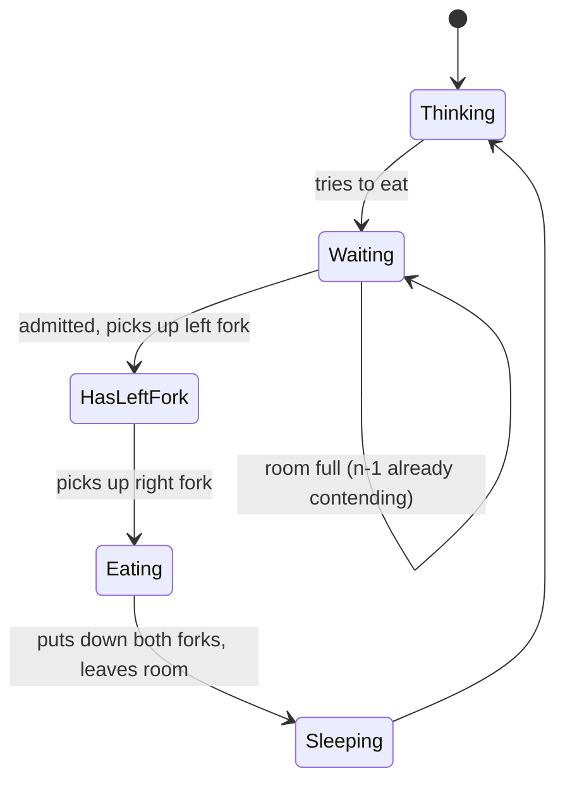
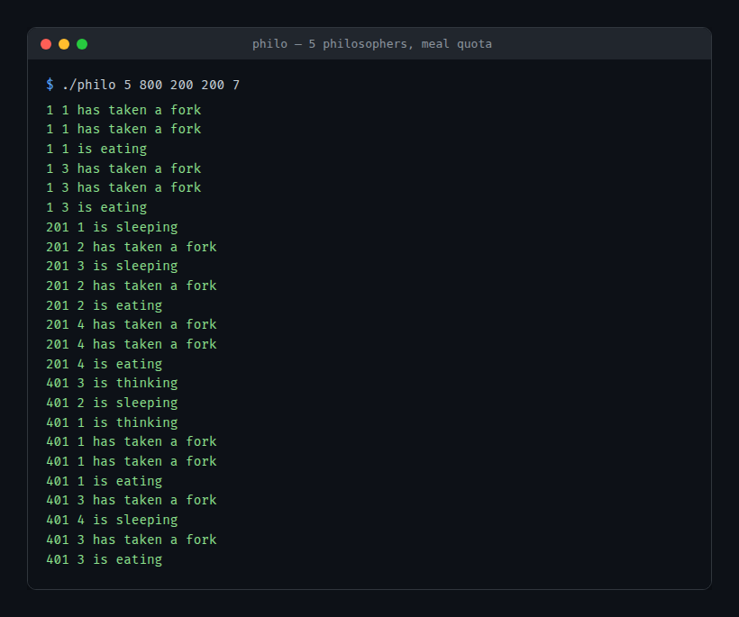
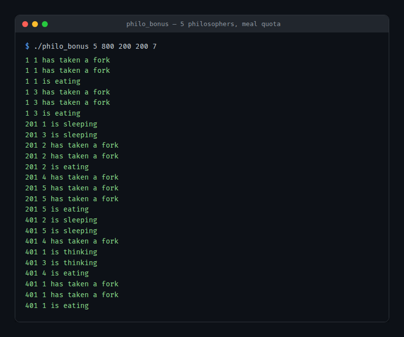
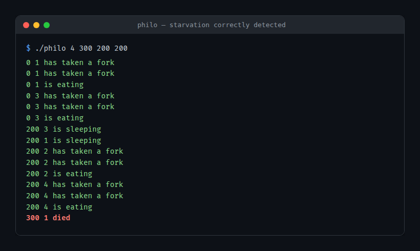

# Dining Philosophers

Five (or N) philosophers share N forks and must never deadlock or starve — a from-scratch C implementation with two independent solutions: one with threads and mutexes, one with processes and semaphores.


<p align="center">
  
</p>

## What this is

N philosophers sit at a round table with N forks, one between each pair. Each
philosopher loops through eating, sleeping and thinking forever, and needs
*both* neighboring forks to eat. Miss a meal for too long and you die, which
ends the simulation. The classic trap: everyone grabs their left fork at once
and waits forever for their right one — deadlock.

Two independent binaries solve it:

- **`philo/`** — each philosopher is a `pthread`, forks are `pthread_mutex_t`.
- **`philo_bonus/`** — each philosopher is its own process (`fork()`), forks
  are POSIX named semaphores.

## How one philosopher's turn works



"Room" is the deadlock-avoidance gate: at most `n - 1` philosophers may hold
a fork and be reaching for the second one at the same time. With `n` forks
on the table, that guarantees at least one of them can always complete —
nobody can ever be stuck holding one fork forever. Admission additionally
favors whoever has gone longest without eating, instead of first-come.

## Quick start

Verified against a clean clone.

```sh
cd philo && make
./philo 5 800 200 200 7   # 5 philosophers, stops once everyone has eaten 7 times
```

```
0 1 has taken a fork
0 1 has taken a fork
0 1 is eating
...
3800 2 is thinking
```

Same for the bonus, from `philo_bonus/`. Full argument list:

```sh
./philo number_of_philosophers time_to_die time_to_eat time_to_sleep [meals_required]
```

All three timing arguments are milliseconds. `meals_required` is optional —
leave it off and the simulation runs until someone dies, or forever if
nobody does. That's `./philo 5 800 200 200` — a valid run with no output for
as long as it runs, since without a meal count there's nothing to stop it.

## Notable bits

- **Fairness is measured, not assumed.** The naive "n-1 concurrent diners"
  deadlock-avoidance trick alone doesn't guarantee anyone gets served in
  time. Testing the plain version against the standard `5 800 200 200`
  survival benchmark showed philosophers dying on ~70% of runs. Adding
  starvation-priority admission (serve whoever's waited longest first) cut
  that to ~2-3%.
- **The bonus's fork model was benchmarked, not just implemented.** The
  natural reading of "forks represented by a semaphore" is one shared
  counting semaphore for the whole table. Built and tested: 60-100%
  false-death rate at every concurrency limit tried, because an anonymous
  token pool has no guarantee that the two tokens you're holding are your
  *actual* neighbors' forks. Switched to one semaphore per fork position
  instead, matching the mutex version's guarantees.
- **A real multi-process buffering bug.** Each bonus philosopher is a
  separate process. A sibling process killed right after another one
  starves loses whatever was sitting unflushed in its own private stdio
  buffer — so most of the simulation's output silently vanished under
  `SIGKILL`. Fixed by writing log lines with `write()` instead of buffered
  `printf()`.

### Known limitation

Neither part has a true FIFO queue behind it (the mandatory part is
mutex-only by design; the bonus has no shared memory to build one from
without extra IPC outside its allowed functions). Under an artificially
perfect, back-to-back-launched stress test, a philosopher can still rarely
lose two fork races in a row and die right at the deadline — a few percent
of runs, not a rare one-in-a-thousand. Closing it fully needs a real ticket
queue, out of scope for what's here.

## Screenshots

| | |
|---|---|
|  `philo`, 5 philosophers, stops once everyone's eaten 7 times |  `philo_bonus`, same scenario, process+semaphore version |
|  A philosopher missing `time_to_die` gets caught and reported within the run — the core correctness requirement. | |

## Repo layout

```
philo/          mandatory: pthreads + mutexes
philo_bonus/    bonus: processes + POSIX semaphores
```

Each has its own `Makefile` (`make`, `clean`, `fclean`, `re`) and no
dependencies beyond a C compiler, `make`, and a POSIX/Linux environment.

## Background

Originally built for 42 School / 1337's Dining Philosophers project — a
concurrency exercise, hence the two mandatory/bonus solutions rather than
one. Since then it's had a full correctness pass: a self-deadlock on a
single philosopher, a death-timer bug, a false-death-after-quota bug, and
the fairness/buffering issues above were all found and fixed with an AI
assistant (Claude), with every change tested against repeated stress runs
before being kept.

- [Dining philosophers problem — Wikipedia](https://en.wikipedia.org/wiki/Dining_philosophers_problem)
- [pthreads(7) man page](https://man7.org/linux/man-pages/man7/pthreads.7.html)
- `man pthread_mutex_lock`, `man sem_overview`
